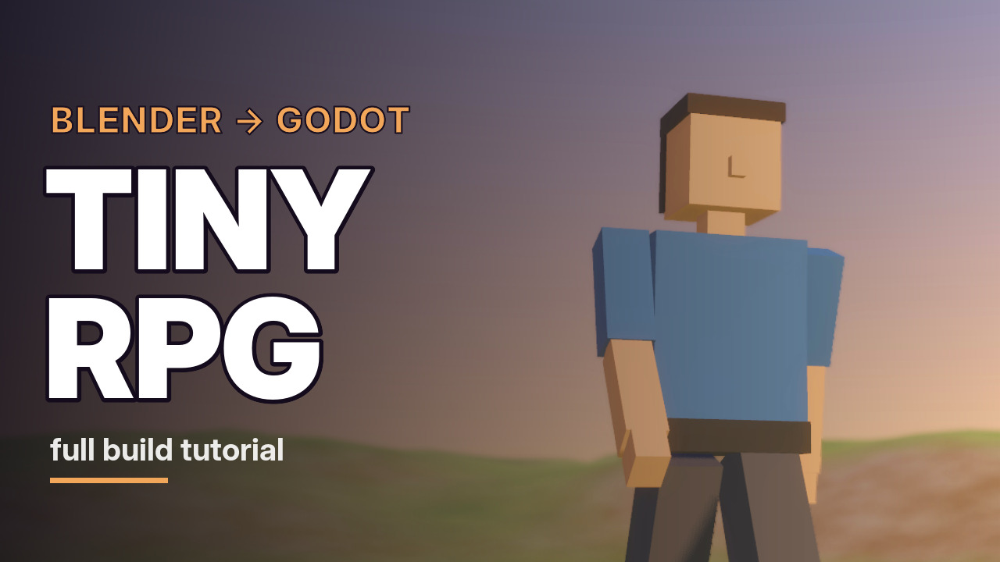

# Tiny RPG

A tiny third-person 3D prototype: a low-poly hero walking across a hilly island at sunset.
Every asset was built in Blender and the game runs in Godot 4.

**▶ [Play it in your browser](https://djeada.github.io/tiny-rpg/)** (desktop browser with WebGL 2; click the game once to give it keyboard focus)



## Controls

| Key | Action |
|---|---|
| W / ↑ | Walk forward |
| S / ↓ | Walk back |
| A / ← | Walk left |
| D / → | Walk right |

## What's inside

| Path | Contents |
|---|---|
| `blender/terrain.blend` | 40 × 40 m terrain: 64 × 64 grid, noise hills (≤ 2.6 m), flat 8 m spawn clearing, baked 1024² albedo |
| `blender/hero.blend` | 1.8 m low-poly hero (244 triangles, one 64² palette texture), 12-bone rig, `Idle` (2 s) and in-place `Walk` (1 s) loops |
| `godot/assets/` | `terrain.glb`, `hero.glb` exported from the .blend files, plus textures and the terrain collision shape |
| `godot/world.tscn` | Main scene: terrain, trimesh collision, map-edge walls, sun with shadows, procedural sky, player |
| `godot/player.tscn`, `godot/player.gd` | `CharacterBody3D` with capsule collision, spring-arm third-person camera, camera-relative movement, Idle/Walk switching |
| `godot/tools/` | Headless scripts that rebuild the scenes and test them (not included in exported builds) |

## Run it locally

Requires [Godot 4.7](https://godotengine.org/download).

```bash
git clone https://github.com/djeada/tiny-rpg.git
cd tiny-rpg
godot --path godot          # play
godot -e --path godot       # open in the editor
```

## Rebuild and test

All scripts run headless from the `godot/` folder:

```bash
godot --headless --path godot --import                                   # import assets
godot --headless --path godot --script res://tools/build_player.gd       # regenerate player.tscn
godot --headless --path godot --script res://tools/build_world.gd        # regenerate world.tscn + collision
godot --headless --path godot --script res://tools/verify_player.gd      # capsule, camera, spring arm checks
godot --headless --path godot --script res://tools/test_player_input.gd  # simulated WASD/arrow input
godot --headless --path godot --script res://tools/test_hills.gd         # walk to every map edge
```

## Web build

The browser version uses Godot's single-threaded web export (works on GitHub Pages without
cross-origin isolation headers) and the Compatibility renderer. To rebuild it you need the
Godot 4.7.2 export templates:

```bash
godot --headless --path godot --export-release "Web" ../build/web/index.html
```

The `gh-pages` branch holds the published build.
